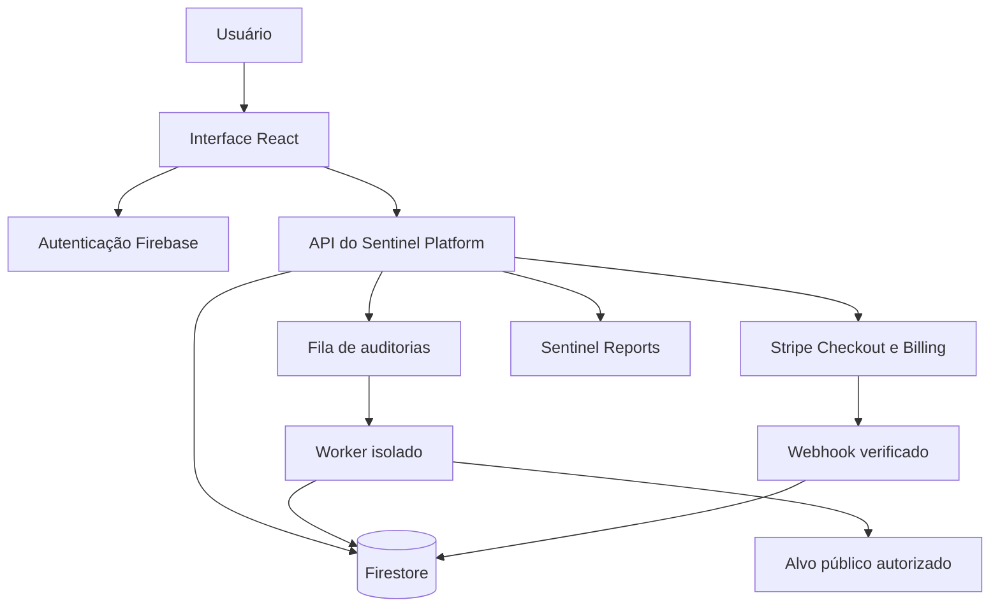

# Arquitetura do Sentinel Platform

## Visão geral

## Princípios de projeto

### Separação de responsabilidades

A interface não decide permissões comerciais nem autoriza auditorias. O servidor valida identidade, plano, consentimento, escopo e estado da operação antes de executar ações protegidas.

### Auditoria defensiva

O Essential Scan observa apenas a superfície pública e não executa exploração destrutiva. Resultados inconclusivos não são promovidos artificialmente a vulnerabilidades.

### Execução segura

Destinos locais, privados, link-local e outros endereços impróprios são bloqueados. Redirecionamentos e resoluções de rede são novamente validados para reduzir risco de SSRF e alteração de DNS durante a execução.

### Cobrança confiável

O Stripe é a fonte de verdade do ciclo de assinatura. Eventos são autenticados, processados com idempotência e refletidos nas permissões mantidas pelo servidor.

### Evidência e evolução

Cada execução preserva contexto, data, alvo, pontuação, achados e metodologia. Isso permite comparar avaliações e demonstrar se o risco está diminuindo.

## Tecnologias

- React, TypeScript e Vite
- Node.js e Express
- Firebase Authentication e Firestore
- Google Cloud Run
- Stripe Billing e Checkout
- GitHub Actions

## Limites públicos

Este documento descreve decisões arquiteturais de alto nível. Implementações internas, regras de detecção, configuração de infraestrutura e controles antifraude não são publicados neste repositório.
