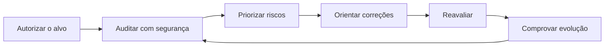

# WebSec Sentinel

Plataforma brasileira de auditoria defensiva contínua para profissionais de tecnologia, consultorias e pequenas empresas.

O WebSec Sentinel transforma sinais técnicos dispersos em uma visão que o cliente consegue acompanhar: o que está exposto, qual é o impacto, o que deve ser corrigido primeiro e se a postura de segurança realmente evoluiu ao longo do tempo.

[Acessar demonstração](https://websec-auto-auditor-325258730362.us-east1.run.app/) · [Conhecer a arquitetura](ARCHITECTURE.md) · [Ver decisões de segurança](SECURITY.md)

## Por que este produto existe

Uma análise pontual costuma terminar em um PDF que envelhece rapidamente. O WebSec Sentinel foi desenhado para criar um ciclo operacional verificável:

O valor não está apenas em encontrar uma configuração incorreta. Está em transformar segurança em histórico, evidência e decisão de negócio.

## Experiência do produto

- **Essential Scan:** avaliação externa gratuita de TLS, cabeçalhos HTTP, DNS/e-mail e exposições comuns.
- **Advanced Scan:** análises ampliadas, histórico persistente e acompanhamento recorrente.
- **Deep Scan:** profundidade avançada para operações profissionais autorizadas.
- **Sentinel Reports:** laudos com escopo, metodologia, limitações, evidências, priorização e orientação de mitigação.
- **Evolução por ativo:** comparação dos resultados de cada domínio ao longo do tempo.
- **Planos comerciais:** Free, Standard e Pro, com assinatura gerenciada pelo Stripe.

## Diferenciais

1. **Segurança como ativo mensurável** — a evolução deixa de depender da memória do fornecedor ou de uma captura isolada.
2. **Comunicação entre técnica e negócio** — riscos são apresentados com impacto, evidência e próxima ação.
3. **Relatórios defensáveis** — o documento declara exatamente o que foi verificado e também o que ficou fora do escopo.
4. **Proteção operacional do scanner** — validação de destino, prevenção de acesso a redes internas, limites e consentimento explícito.
5. **Modelo adequado para consultorias** — identidade profissional e histórico ajudam o auditor a demonstrar valor recorrente ao cliente.

## Arquitetura resumida

- Interface responsiva em React e TypeScript.
- API em Node.js/Express executada no Google Cloud Run.
- Autenticação e persistência no Firebase.
- Assinaturas, checkout e portal do cliente no Stripe.
- Execução assíncrona de auditorias com limites de escopo.
- Pipeline automatizado com testes, validação TypeScript e build de produção.

O motor de auditoria, as regras de detecção, os controles comerciais e a infraestrutura de produção são mantidos em repositório privado.

## Qualidade e segurança

O projeto aplica, entre outros controles:

- mitigação de SSRF e bloqueio de destinos privados, locais e link-local;
- autorização do usuário e separação de dados por conta;
- confirmação expressa de responsabilidade sobre o alvo;
- webhooks de cobrança verificados e operações idempotentes;
- segredos fora do código-fonte;
- resultados inconclusivos separados de vulnerabilidades confirmadas;
- testes automatizados de políticas HTTP, rede segura, pontuação e geração de relatórios.

## Estado atual

O produto está em fase de MVP operacional e validação com usuários-piloto. A versão publicada utiliza o **Essential Scan** de maneira não destrutiva. Avaliações profundas devem ocorrer somente em ativos expressamente autorizados.

## Minha contribuição

Projeto concebido e desenvolvido por **Onyalan Silva Almeida**, abrangendo estratégia de produto, experiência da aplicação, arquitetura full-stack, mecanismos defensivos, modelo comercial e integração de pagamentos.

## Sobre este repositório

Este é o repositório público de apresentação técnica do produto. Ele foi intencionalmente separado do código comercial completo para conciliar transparência profissional, demonstração de engenharia e proteção da propriedade intelectual.

Copyright © 2026 Onyalan Silva Almeida. Todos os direitos reservados. A publicação deste material não concede licença para copiar, redistribuir ou explorar comercialmente o produto.
